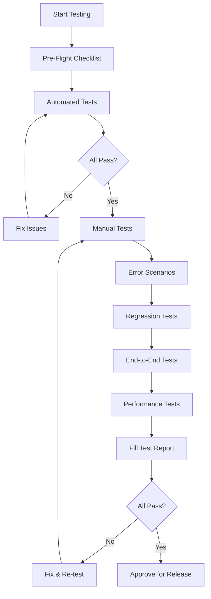

# Integration Test Suite for Auto-Update System

This directory contains comprehensive integration tests for the PrintPhotoApp auto-update system.

---

## Test Files Overview

### Automated Tests (Run with Node.js)

| File | Purpose | Run Command |
|------|---------|-------------|
| `validate-github-workflow.js` | Validates GitHub Actions workflow syntax and configuration | `node tests/validate-github-workflow.js` |
| `test-config-validation.js` | Validates all config files (package.json, main.js, preload.js, etc.) | `node tests/test-config-validation.js` |
| `test-startup-flow.js` | Tests startup sequence and build artifacts | `node tests/test-startup-flow.js` |
| `test-ipc-channels.js` | Tests IPC communication (run in browser DevTools) | Copy/paste into app console |

### Manual Test Procedures

| File | Purpose | When to Use |
|------|---------|-------------|
| `MANUAL_TESTS.md` | Comprehensive manual testing procedures | Full integration testing |
| `test-error-scenarios.md` | Error handling and edge case tests | Before release |
| `test-regression.md` | Existing feature regression tests | After any update changes |
| `QUICK_TEST_GUIDE.md` | Rapid validation (20 min) | Quick sanity check |
| `RUN_ALL_TESTS.md` | Complete test suite execution guide | Full QA cycle |

### Test Documentation

| File | Purpose |
|------|---------|
| `TEST_REPORT.md` | Test results documentation template |
| `pre-flight-checklist.md` | Environment setup verification |
| `README.md` | This file - test suite overview |

---

## Quick Start

### For Rapid Validation (20 minutes)

```bash
# Run all automated tests
node tests/validate-github-workflow.js
node tests/test-config-validation.js
node tests/test-startup-flow.js

# Follow quick guide
notepad tests/QUICK_TEST_GUIDE.md
```

### For Complete Testing (2-3 hours)

```bash
# 1. Pre-flight
notepad tests/pre-flight-checklist.md

# 2. Run all tests
notepad tests/RUN_ALL_TESTS.md

# 3. Document results
notepad tests/TEST_REPORT.md
```

---

## Test Categories

### 1. Component Integration Tests
- IPC communication (main ↔ renderer)
- App startup flow
- Update detection
- UI components

### 2. Flow Integration Tests
- Download flow (progress, interruption, completion)
- Installation flow (quit, install, relaunch)
- Error recovery flows

### 3. External Integration Tests
- GitHub Actions CI/CD
- GitHub Releases API
- File system (logs, temp files)

### 4. Regression Tests
- Printing system
- Layout management
- PDF export
- Image editing
- Multi-page navigation
- State management (undo/redo)

### 5. End-to-End Scenarios
- First-time update experience
- Remind later workflow
- No update available
- Network error recovery

### 6. Performance Tests
- Startup time
- Memory usage
- CPU usage
- File system impact

---

## Test Execution Workflow



---

## Test Results Interpretation

### Automated Test Results

**Exit Code 0:** All tests passed ✅
```bash
echo $LASTEXITCODE  # Should be 0
```

**Exit Code 1:** Some tests failed ❌
- Review console output
- Fix issues
- Re-run tests

### Manual Test Results

**Format:**
- ☐ = Not tested
- ✅ = Passed
- ❌ = Failed
- ⚠️ = Warning/Issue

**Pass Criteria:**
- 100% of critical tests must pass
- < 10% of non-critical tests can have warnings
- Zero blocker (P0) issues

---

## Common Test Scenarios

### Testing Without Real Update

**Problem:** No new version available to test update flow

**Solutions:**

1. **UI Testing:** Manually trigger banner in console
2. **Create Test Release:** Use `-test` suffix (v1.0.4-test)
3. **Mock Data:** Temporarily modify update.js for testing

### Testing With Multiple Versions

**Setup:**
1. Install v1.0.3
2. Create release v1.0.4
3. Test update flow
4. Create release v1.0.5
5. Test again (v1.0.4 → v1.0.5)

### Testing Error Scenarios

**Network Errors:**
- Disable WiFi/ethernet
- Use Windows firewall to block app
- Use Fiddler to inject errors

**File Errors:**
- Modify latest.yml manually
- Delete files from release
- Corrupt downloaded files

---

## Test Data Requirements

### Sample Images
- Minimum: 10 photos
- Formats: JPEG, PNG
- Sizes: Various (landscape, portrait, square)
- Location: `tests/sample-images/`

### Test Layouts
- simple-layout.json (1 page, basic)
- complex-layout.json (multi-page, edited)
- edge-case-layout.json (max pages, rotations)

---

## Logging and Debugging

### Where to Find Logs

**Update Logs:**
```bash
# Windows
type %TEMP%\PrintPhotoApp-updates.log

# PowerShell
Get-Content $env:TEMP\PrintPhotoApp-updates.log -Tail 50
```

**App Logs:**
```bash
%APPDATA%\PrintPhotoApp\logs\
```

**GitHub Actions Logs:**
- Repository → Actions → Select workflow run → View logs

### What to Look For

**Successful Update Check:**
```
=== Initializing Auto-Updater ===
App version: 1.0.3
Checking for updates...
Update available: 1.0.4
```

**Failed Update Check:**
```
Checking for updates...
Error: [specific error]
```

**Download Progress:**
```
Download progress: 25%
Download progress: 50%
Download progress: 75%
```

---

## Troubleshooting Tests

### "App won't start after build"

```bash
# Check build output
dir dist

# Verify installer exists
dir dist\*.exe

# Try running from unpacked
cd dist\win-unpacked
PrintPhotoApp.exe
```

### "IPC tests show undefined"

**Cause:** preload.js not loading

**Fix:**
- Check main.js: webPreferences.preload path
- Verify preload.js exists
- Check console for preload errors

### "Update check never happens"

**Check:**
1. Is app packaged? `app.isPackaged`
2. Check logs for initialization
3. Verify 5-second delay elapsed
4. Network connectivity

---

## Test Maintenance

### After Code Changes

**If you modified:**
- `main.js` → Re-run config validation
- `updateHandler/update.js` → Re-run IPC tests
- `preload.js` → Re-run IPC tests
- UI files → Re-test banner UI
- Build config → Re-run workflow validation

### Before Each Release

**Minimum tests:**
1. Run automated tests
2. Test update detection
3. Test one complete update flow
4. Quick regression check

**Full suite:**
- Run before major releases
- Run after significant changes
- Run periodically (monthly)

---

## Test Coverage

### What's Tested

✅ IPC communication (all channels)
✅ App startup (dev & production)
✅ Update detection (version comparison)
✅ UI integration (banner, animations)
✅ Download flow (progress, errors)
✅ Installation flow (quit, install, relaunch)
✅ GitHub Actions (build, release)
✅ Error handling (network, permission, invalid data)
✅ Regressions (all existing features)
✅ Performance (startup, memory, CPU)

### What's NOT Tested (Out of Scope)

❌ Unit tests for individual functions
❌ Browser compatibility (Electron only)
❌ Mobile platforms
❌ macOS builds (Windows only)
❌ Linux builds

---

## Success Metrics

### Critical Metrics

**All must pass:**
- Workflow validation: 17/17 checks ✅
- Config validation: 66/66 checks ✅
- App startup: < 2 seconds
- No regressions: 0 features broken
- Update flow: Works end-to-end

### Performance Targets

- Startup time: < 2000ms
- Memory usage: < 200MB idle
- CPU usage: < 5% idle
- Update check: < 10s
- Download: Depends on connection
- Install: < 30s

---

## Contact

**Questions about tests?**
- Review test file comments
- Check IMPLEMENTATION_SUMMARY.md
- Check RELEASE.md troubleshooting

**Found a bug?**
- Document in TEST_REPORT.md
- Create GitHub issue
- Include logs and steps to reproduce

---

## Test File Map

```
tests/
├── README.md                      ← You are here
├── QUICK_TEST_GUIDE.md           ← 20-min rapid test
├── RUN_ALL_TESTS.md              ← Complete test guide
├── MANUAL_TESTS.md               ← Manual test procedures
├── TEST_REPORT.md                ← Results documentation
├── pre-flight-checklist.md       ← Environment setup
├── validate-github-workflow.js   ← Automated workflow check
├── test-config-validation.js     ← Automated config check
├── test-startup-flow.js          ← Automated startup test
├── test-ipc-channels.js          ← Browser console tests
├── test-error-scenarios.md       ← Error case tests
└── test-regression.md            ← Existing feature tests
```

---

**Last Updated:** January 27, 2026

**Test Suite Version:** 1.0
